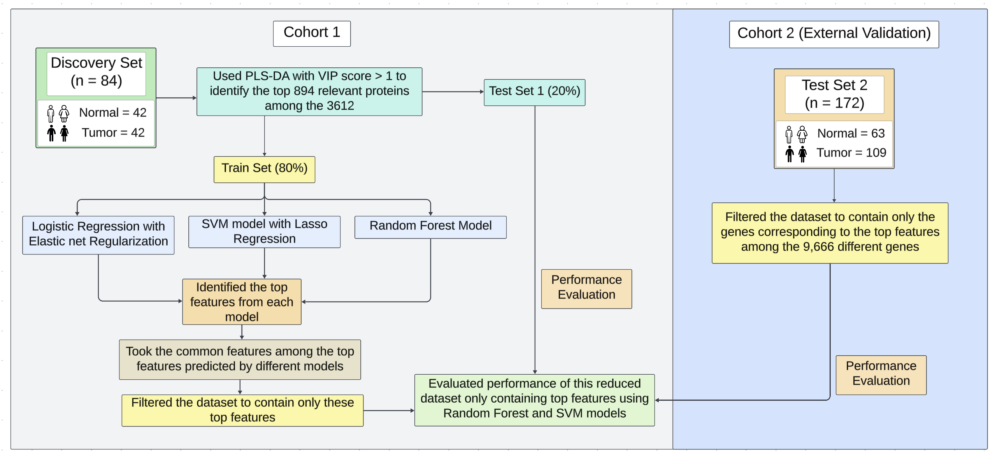

# Oral Squamous Cell Carcinoma (OSCC) - Biomarker Identification

This repository contains the work undertaken during the **Oral Squamous Cell Carcinoma (OSCC) Research and Development (R&D) project**. The project focuses on identifying robust molecular biomarkers for the early detection of OSCC using **proteomics** and **metabolomics** data combined with advanced machine learning techniques.

---

## Overview

Oral Squamous Cell Carcinoma (OSCC) is a prevalent and aggressive form of cancer with poor survival rates due to late-stage diagnosis. This study integrates high-dimensional biological data with machine learning techniques to identify potential biomarkers that could improve early detection and enable personalized treatment strategies.

Key contributions include:
- Identifying critical proteins and metabolites as potential biomarkers.
- Applying feature selection techniques to reduce high-dimensional datasets.
- Implementing and comparing machine learning models for biomarker selection and classification.

---

## Features

1. **Proteomics Analysis**
   - Analyzed protein expression data from 84 samples (42 patients).
   - Identified top proteins using machine learning models:
     - Logistic Regression with Elastic Net Regularization
     - Support Vector Machines (SVM) with Recursive Feature Elimination (RFE) & L1 Regularization
     - Random Forest
   - Selected five common proteins as robust biomarkers.\
   **Work Flow:**
   

2. **Metabolomics Analysis**
   - Processed metabolomics datasets:
     - Tumor vs. Normal Adjacent Tissue (NAT)
     - OSCC vs. PM vs. Normal groups
   - Reduced high-dimensional data using statistical techniques:
     - OPLS-DA and PLS-DA in MetaboAnalyst.
   - Implemented machine learning models to select key metabolites.

3. **Model Evaluation**
   - Compared models based on classification accuracy and AUC scores.
   - Best-performing models:
     - Random Forest: 100% accuracy in positive datasets.
     - SVM with L1 Regularization: Excellent performance in negative datasets.

4. **Integration**
   - Combined the top 25 features from metabolomics with proteomics biomarkers to create a comprehensive biomarker panel for OSCC classification.

---

## Results

- **Key Biomarkers**: Identified five common proteins (P27338, P51888, Q03692, Q6UWY5, Q92598) as robust classifiers.
- **Best Models**:
  - Random Forest: Consistent high performance across datasets.
  - SVM with L1 Regularization: Effective in specific datasets.
- **Validation**: Proteomics biomarkers are validated using CPTAC datasets, achieving up to 97% accuracy on the validation set.

---

## Tools and Technologies

- **Languages**: Python 
- **Tools**: Jupyter Notebook
- **Libraries**:
  - `pandas` and `numpy` for data manipulation. 
  - `scikit-learn` for machine learning models.
  - `seaborn` and `matplotlib` for data visualization.
- **Statistical Tools**: MetaboAnalyst for feature reduction.
- **LaTeX**: Used for generating detailed reports.

---

## Project Structure

```plaintext
./
├── metabolomics/             # Metabolomics data analysis and results
├── proteomics/               # Proteomics data analysis and results
├── report/report.tex         # LaTeX file for the project report
├── report/report.pdf         # Final report in PDF format
├── README.md                 # Project description and overview
```
## Future Work
- Validate findings on larger, independent datasets.
- Develop non-invasive diagnostic tools using the identified biomarkers.
- Explore the integration of clinical data with omics datasets for improved classification.

## References

1. Judith, Laura, et al. “Applications of Machine Learning in Human Microbiome Studies: A Review on Feature Selection, Biomarker Identification, Disease Prediction, and Treatment.” *Frontiers in Microbiology*, vol. 12, 2021. [DOI:10.3389/fmicb.2021.634511](https://doi.org/10.3389/fmicb.2021.634511)

2. Shi, Zhiao, et al. “Feature Selection Methods for Protein Biomarker Discovery from Proteomics or Multiomics Data.” *Molecular & Cellular Proteomics*, vol. 20, 2020. [DOI:10.1016/j.mcpro.2021.100083](https://doi.org/10.1016/j.mcpro.2021.100083)

3. Leclercq, Mickael, et al. “Large-Scale Automatic Feature Selection for Biomarker Discovery in High-Dimensional OMICs Data.” *Frontiers in Genetics*, vol. 10, 2019. [DOI:10.3389/fgene.2019.00452](https://doi.org/10.3389/fgene.2019.00452)

4. Al-Tashi, Qasem, et al. “Machine Learning Models for the Identification of Prognostic and Predictive Cancer Biomarkers: A Systematic Review.” *International Journal of Molecular Sciences*, vol. 24, no. 9, 2023. [DOI:10.3390/ijms24097781](https://doi.org/10.3390/ijms24097781)

5. Chen, Yangzi, et al. “Metabolomic Machine Learning Predictor for Diagnosis and Prognosis of Gastric Cancer.” *Nature Communications*, vol. 15, no. 1, 2024, pp. 1-13. [DOI:10.1038/s41467-024-46043-y](https://doi.org/10.1038/s41467-024-46043-y)

6. Chong, J., Wishart, D.S., Xia, J. “Using MetaboAnalyst 6.0 for Comprehensive and Integrative Metabolomics Data Analysis.” *Current Protocols in Bioinformatics*, vol. 68, 2019, e86. [MetaboAnalyst](https://dev.metaboanalyst.ca/ModuleView.xhtml)


## Contributors
- Soumitra Darshan Nayak (22B0984)
- Guide: Prof. Sanjeeva Srivastava
- Guide: Avinash Singh